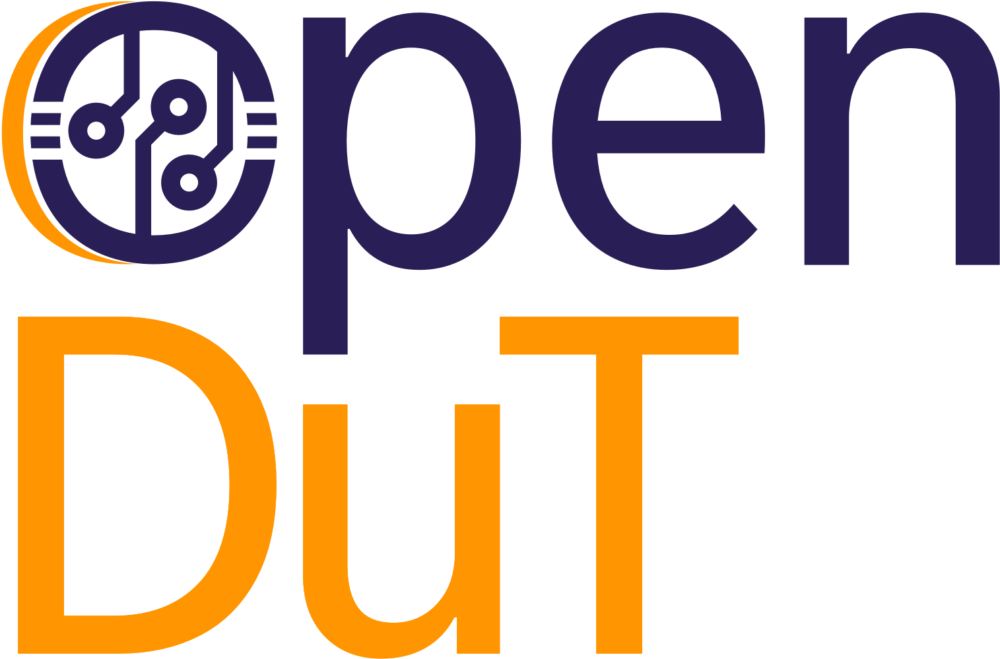

    <picture style="padding-bottom: 3em;">
      <source media="(prefers-color-scheme: dark)" srcset="resources/logos/logo_dark.png" />
      <source media="(prefers-color-scheme: light)" srcset="resources/logos/logo_light.png" />
      
    </picture>

# Eclipse openDuT

Test Electronic Control Units around the world in a transparent network.

Eclipse openDuT provides an open framework to automate the testing and validation process for automotive software and applications in a reliable, repeatable and observable way. Eclipse openDuT is hardware-agnostic with respect to the execution environment and accompanies different hardware interfaces and standards regarding the usability of the framework. Thereby, it is supporting both on-premise installations and hosting in a cloud infrastructure. Eclipse openDuT considers an eventually distributed network of real (HIL) and virtual devices (SIL) under test. Eclipse openDuT reflects hardware capabilities and constraints along with the chosen test method. Test cases are not limited to a specific domain, but it especially realizes functional and explorative security tests.

## Developer Setup

Find out how to [get started here](https://opendut.eclipse.dev/book/development/getting-started.html).

## Usage
For using openDuT, find our [user manual here](https://opendut.eclipse.dev/book/user-manual/index.html).

## Contribution
We are delighted that you are interested in making Eclipse openDuT better!
This project welcomes all contributions: ideas, patches, documentation, bug reports.
But before contributing, make sure to read the [contribution guideline](CONTRIBUTING.md).

You can also check out our list of [Good First Issues](https://github.com/eclipse-opendut/opendut/issues/91).

## License
Eclipse openDuT is licensed using the Apache License Version 2.0.

## Attribution
openDuT uses [NetBird](https://netbird.io/) and [WireGuard](https://www.wireguard.com/) to establish a VPN network.
