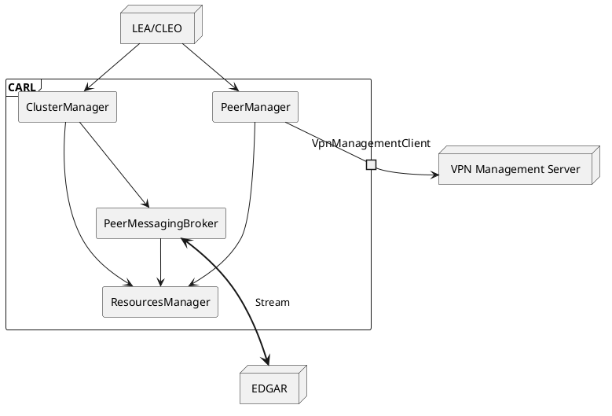

# CARL

```plantuml
@startuml
node "LEA/CLEO" as UI

frame CARL {
  agent ClusterManager
  agent PeerManager
  agent PeerMessagingBroker
  agent ResourcesManager
  portout VpnManagementClient
}
node "VPN Management Server"
node EDGAR

UI --> ClusterManager
UI --> PeerManager

ClusterManager --> PeerMessagingBroker
ClusterManager ---> ResourcesManager
PeerManager -- VpnManagementClient
PeerManager ---> ResourcesManager
PeerMessagingBroker --> ResourcesManager

PeerMessagingBroker <===> EDGAR : Stream

VpnManagementClient -> "VPN Management Server"

@enduml
```
