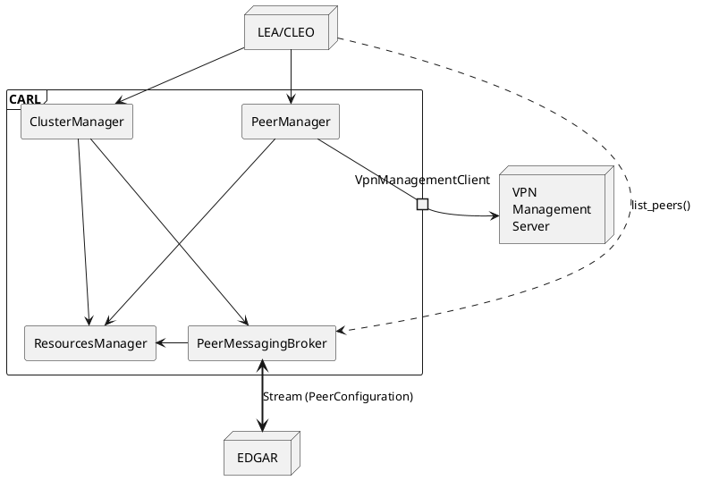

# CARL

```plantuml
@startuml
node "LEA/CLEO" as UI

frame CARL {
  agent ClusterManager
  agent PeerManager
  portout VpnManagementClient
  agent PeerMessagingBroker
  agent ResourcesManager
}
node "VPN\nManagement\nServer" as VpnManagementServer
node EDGAR

UI --> ClusterManager
UI --> PeerManager
UI ...> PeerMessagingBroker : list_peers()

ClusterManager --> PeerMessagingBroker
ClusterManager ---> ResourcesManager
PeerManager -- VpnManagementClient
PeerManager ---> ResourcesManager
ResourcesManager <- PeerMessagingBroker

PeerMessagingBroker <==> EDGAR : Stream (PeerConfiguration)

VpnManagementClient -> VpnManagementServer

@enduml
```
