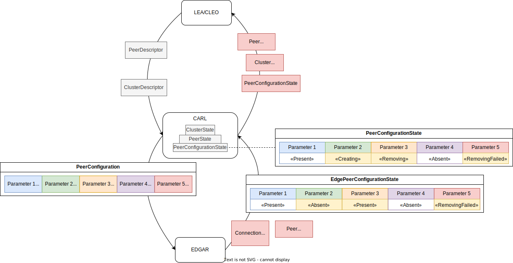

# Configuration/State Loop

When the user configures a Peer or a Cluster, LEA/CLEO sends us a `PeerDescriptor` or `ClusterDescriptor` respectively.

To instruct EDGAR what configuration it should roll out, we send it a `PeerConfiguration`, which is derived from these `Descriptors` and additional information that CARL may have.

EDGAR reports back a `EdgePeerConfigurationState` to indicate how far along it is in rolling out this `PeerConfiguration`, as well as its general health.

This `EdgePeerConfigurationState` is then compared to the `PeerConfiguration` to determine what configuration tasks are still in progress.
Along with the peer's general health information, this is then reported to LEA/CLEO in a PeerStatusReport.

## PeerConfigurationState

To determine the `PeerConfigurationState` we need to compare the `PeerConfiguration` and `EdgePeerConfigurationState`.
When a Parameter is "Present" in PeerConfiguration and "Absent" in EdgePeerConfigurationState, it is assumed to be "Creating", unless an error has been reported. This works similarly for "Removing", "Present" and "Absent".

| PeerConfiguration | EdgePeerConfigurationState | PeerConfigurationState |
|-------------------|----------------------------|------------------------|
| present           | present + OK               | PRESENT                |
| absent            | absent  + OK               | ABSENT                 |
| present           | absent  + OK               | CREATING               |
| absent            | present + OK               | REMOVING               |
| present           | absent  + error            | CREATING + Error       |
| absent            | present + error            | REMOVING + Error       |

Detected state unknown in EdgePeerConfigurationState:

| PeerConfiguration | EdgePeerConfigurationState | PeerConfigurationState            |
|-------------------|----------------------------|-----------------------------------|
| present           | unknown  + error           | CREATING + CheckFailed            |
| absent            | unknown  + error           | REMOVING + CheckFailed            |
| present           | unknown  + error           | CREATING + WaitingForDependencies |
| absent            | unknown  + error           | REMOVING + WaitingForDependencies |

Configuration parameter is missing at one side:

| PeerConfiguration | EdgePeerConfigurationState | PeerConfigurationState | Comment                                              |
|-------------------|----------------------------|------------------------|------------------------------------------------------|
| present           | not appear                 | CREATING               | backend expects it, edge hasn't reported it yet      |
| absent            | not appear                 | ABSENT                 | both sides agree it's absent                         |
| not appear        | absent  + OK               | ABSENT                 | both sides agree it's absent                         |
| not appear        | present + OK               | REMOVING               | 
| not appear        | present + error            | REMOVING + Error       |
| not appear        | absent  + error            | CREATING + Error       |
| not appear        | unknown  + error           |                        |

With the `PeerConfigurationState` we want to tell if the edge device has applied all required configuration tasks and is considered `ready`.

## Ideas behind this design

* Treat EDGAR as a dumb runner – it should not make own decisions.
  Rather it is given a complete set of configuration parameters (`PeerConfiguration`) to apply.
  CARL makes the decisions.
  * It needs to be possible to remove configuration parameter deployments generically,
    by marking them `Absent` rather than `Present`.
  * There will be Tasks, akin to EDGAR Setup, which can check whether a configuration parameter deployment is present/absent,
    and know how to apply or unapply this configuration.

* EDGAR can report how far it has applied the PeerConfiguration as a `EdgePeerConfigurationState`.
  The EdgePeerConfigurationState needs to be linkable to the PeerConfiguration.

* UIs should get a report on the state of a peer (`PeerStatusReport`).
  This PeerStatusReport needs to be derived from the EdgePeerConfigurationState.

* It needs to be possible to designate dependencies between configuration parameters,
  as e.g. an interface cannot be joined to a bridge, if the bridge does not yet exist.

* EDGAR should be able to restart or reconnect, and then apply the newest `PeerConfiguration` without hiccups.
  As such, the `PeerConfiguration` may not depend on a supposed state of EDGAR.

* When a `PeerConfiguration` is applied, this needs to be idempotent.
