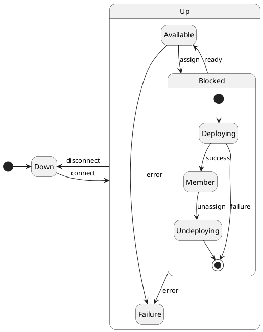

# Peer

## PeerState

When an EDGAR manages multiple devices, these can only be configured into one deployed Cluster.  
It is not possible to use some of these devices in one deployed Cluster and some in another.  

This is due to the current architecture only supporting one EDGAR per peer computer (the machine placed next to your ECU),  
and only one Cluster being allowed to be deployed per EDGAR, as this simplifies management of the VPN client and network interfaces considerably.

Theoretically, it is possible to deploy two EDGARs onto a peer computer by isolating them via containers,
or to use two peer computers for one ECU.

