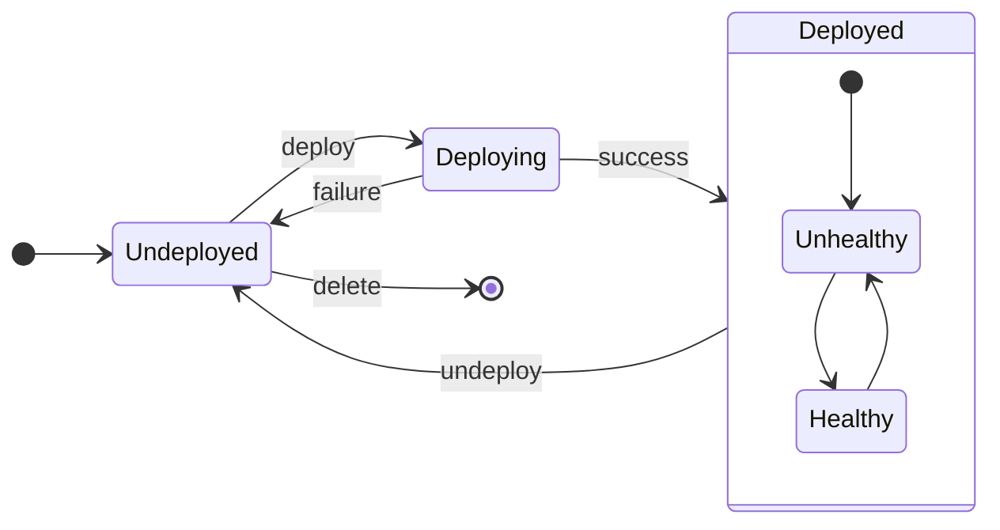

# Cluster

## ClusterState

```mermaid
stateDiagram-v2
direction LR

    [*] --> Undeployed
    Undeployed --> Deploying: deploy
    Deploying --> Deployed: success
    Deploying --> Undeployed: failure
    state Deployed {
        [*] --> Unhealthy
        Healthy --> Unhealthy
        Unhealthy --> Healthy
    }
    Deployed --> Undeployed: undeploy
    Undeployed --> [*]: delete
```
