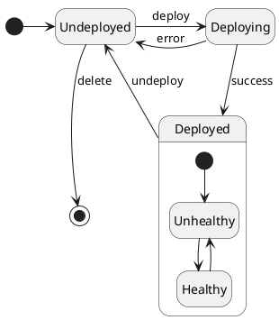

# Cluster

## ClusterState

```plantuml
@startuml
hide empty description

state "Undeployed" as undeployed
state "Deploying" as deploying
state "Deployed" as deployed {
  state "Healthy" as healthy
  state "Unhealthy" as unhealthy
  [*] -down-> unhealthy
  unhealthy -down-> healthy
  healthy -up-> unhealthy
}

[*] -right-> undeployed
undeployed --> [*] : delete
undeployed -right-> deploying : deploy
deploying -left-> undeployed : error
deploying -right-> deployed : success
deployed --> undeployed : undeploy

@enduml
```
