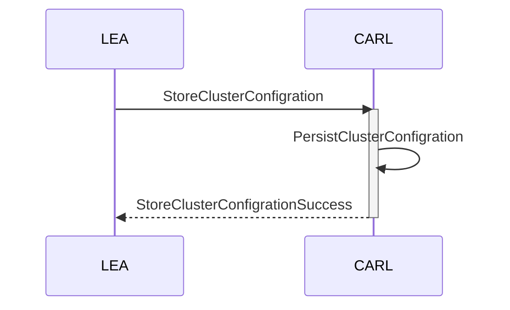

# Cluster

## Cluster creation



```
{{#include ../../../../opendut-types/proto/opendut/types/cluster/cluster.proto:ClusterConfiguration}}
```

## Cluster Deployment

```
{{#include ../../../../opendut-types/proto/opendut/types/cluster/cluster.proto:ClusterAssignment}}
```
```
{{#include ../../../../opendut-types/proto/opendut/types/cluster/cluster.proto:PeerClusterAssignment}}
```
