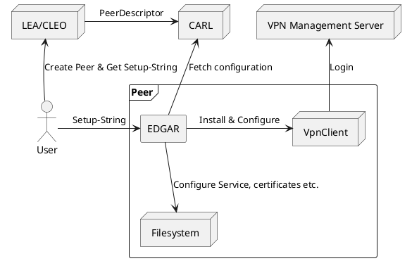
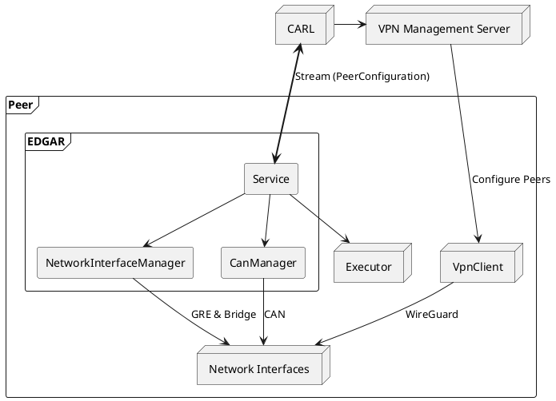

# EDGAR

## Setup

```plantuml
@startuml
node "LEA/CLEO" as UI
actor "User"

frame Peer {
  agent EDGAR
  node VpnClient
  node Filesystem
}
node CARL
node "VPN Management Server"

UI <-- User : Create Peer & Get Setup-String
User -> EDGAR : Setup-String
UI -> CARL : PeerDescriptor

CARL <-- EDGAR : Fetch configuration

EDGAR -> VpnClient : Install & Configure
EDGAR --> Filesystem : Configure Service, certificates etc.

"VPN Management Server" <-- VpnClient : Login

@enduml
```

## Service

```plantuml
@startuml
frame Peer {
  node VpnClient
  frame EDGAR {
    agent "Service" as EdgarService
    agent NetworkInterfaceManager
    agent CanManager
  }
  node "Network Interfaces" as Interfaces
  node Executor
}
node CARL
node "VPN Management Server"

CARL <==> EdgarService : Stream (PeerConfiguration)
CARL -> "VPN Management Server"

"VPN Management Server" --> VpnClient : Configure Peers

EdgarService --> NetworkInterfaceManager
EdgarService --> CanManager
EdgarService --> Executor
NetworkInterfaceManager --> Interfaces : GRE & Bridge
CanManager --> Interfaces : CAN
VpnClient --> Interfaces : WireGuard

@enduml
```
