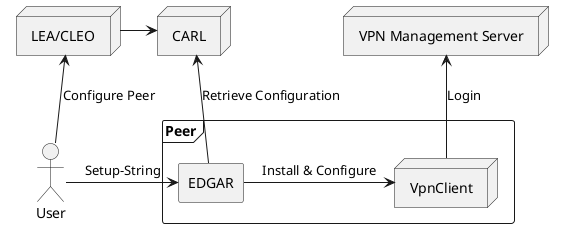
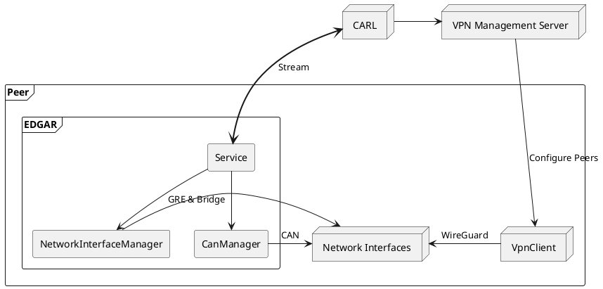

# EDGAR

## Setup

```plantuml
@startuml
node "LEA/CLEO" as UI
actor "User"

frame Peer {
  node VpnClient
  agent EDGAR
}
node CARL
node "VPN Management Server"

UI <-- User : Configure Peer
User -> EDGAR : Setup-String
UI -> CARL

CARL <-- EDGAR : Retrieve Configuration

EDGAR -> VpnClient : Install & Configure

"VPN Management Server" <-- VpnClient : Login

@enduml
```

## Service

```plantuml
@startuml
frame Peer {
  node VpnClient
  frame EDGAR {
    agent "Service" as EdgarService
    agent NetworkInterfaceManager
    agent CanManager
  }
  node "Network Interfaces" as Interfaces
}
node CARL
node "VPN Management Server"

CARL <==> EdgarService : Stream
CARL -> "VPN Management Server"

"VPN Management Server" --> VpnClient : Configure Peers

EdgarService --> NetworkInterfaceManager : GRE & Bridge
EdgarService --> CanManager
NetworkInterfaceManager -> Interfaces
CanManager -> Interfaces : CAN
Interfaces <- VpnClient : WireGuard

@enduml
```
