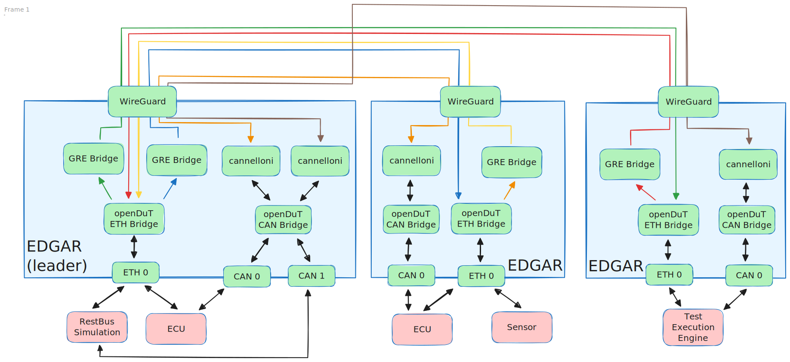

# Overview

### Components
- **CARL** (Control And Registration Logic)
- **EDGAR** (Edge Device Global Access Router)
- **LEA** (Leasing ECU Access)
- **CLEO** (Command-Line ECU Orchestrator)
- **DUT** (Device under test)

# Functional description
openDuT provisions an end-to-end encrypted private network between **Devices under Test** (DuT), Test Execution Engines, RestBus simulations, and other devices.
To achieve this, openDuT uses **Edge Device Global Access Router** (EDGAR),
which can tunnel the Ethernet traffic (Layer 2) of the connected devices into the openDuT network using **Generic Routing Encapsulation** (GRE). CAN traffic is tunnelled between EDGAR instances using [cannelloni](https://github.com/mguentner/cannelloni).
EDGAR registers with the **Control and Registration Logic** (CARL) and reports the type and status of its connected devices.
Multiple EDGARs can be linked to clusters via the graphical **Leasing ECU Access** (LEA) UI or the **Command-Line ECU Orchestrator** (CLEO) of CARL,
and the openDuT cluster can be provisioned for the user.

openDuT uses NetBird technology and provides its own NetBird server, including a TURN server in CARL and NetBird clients in the EDGARs.
The NetBird clients of the clustered EDGARs automatically build a WireGuard network in star topology.
If a direct connection between two EDGARs is not possible, the tunnel is routed through the TURN server in CARL.

Within EDGAR, the openDuT ETH Bridge manages Ethernet communication and routes outgoing packets to the GRE-Bridge(s).
The GRE-Bridges encapsulate the packets and send them over fixed-assigned sources to fixed-assigned targets.
When encapsulating, GRE writes the source and header information and the protocol type of the data packet into the GRE header of the packet.
This offers the following advantages: different protocol types can be sent, network participants can be in the same subnet, and multiple VLANs can be transmitted through a single WireGuard tunnel.

CAN interfaces on EDGAR are connected by means of the openDuT CAN Bridge, which is effectively a virtual CAN interface connected to the individual interfaces by means of `can-gw` rules. Between the leading EDGAR and each other EDGAR, a cannelloni tunnel is established, linking the CAN bridges of different EDGAR instances together.
