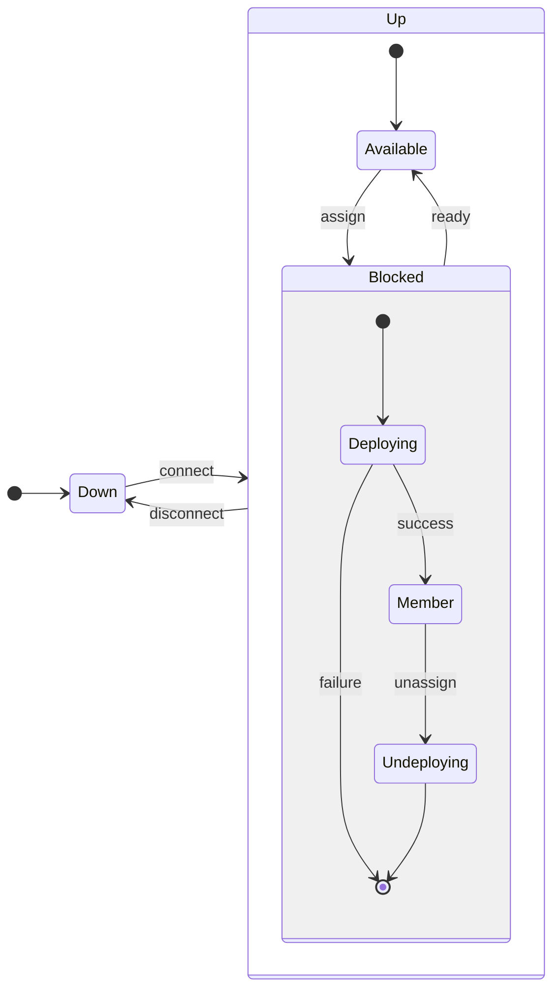

# Peer

## PeerState

```mermaid
stateDiagram-v2
direction LR

    [*] --> Down
    Down --> Up: connect
    Up --> Down: disconnect
    state Up {
        [*] --> Available
        Available --> Blocked: assign
        Blocked --> Available: ready
        state Blocked {
            [*] --> Deploying
            Deploying --> Member: success
            Deploying --> [*]: failure
            Member --> Undeploying: unassign
            Undeploying --> [*]
        }
    }
```
