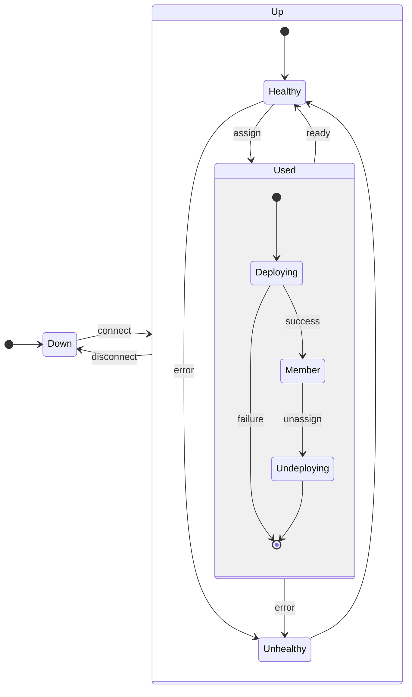

# Peer

## PeerState

```mermaid
stateDiagram-v2
direction LR
    [*] --> Down
    Down --> Up: connect
    Up --> Down: disconnect
    state Up {
        [*] --> Healthy
        Healthy --> Used: assign
        Used --> Healthy: ready
        Used --> Unhealthy: error
        Healthy --> Unhealthy: error
        Unhealthy --> Healthy
        state Used {
            [*] --> Deploying
            Deploying --> Member: success
            Deploying --> [*]: failure
            Member --> Undeploying: unassign
            Undeploying --> [*]
        }
    }
```
