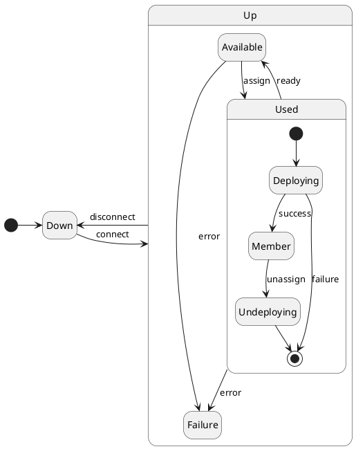

# Peer

## PeerState

```plantuml
@startuml
hide empty description

state "Down" as down
state "Up" as up {
  state "Failure" as failure
  state "Available" as available
  state "Used" as used {
    state "Deploying" as deploying
    state "Undeploying" as undeploying
    state "Member" as member

    [*] --> deploying
    deploying --> member : success
    member --> undeploying : unassign
    deploying --> [*] : failure
    undeploying --> [*]
  }
}

[*] -right-> down
down -right-> up : connect
up -left-> down : disconnect

available --> used : assign
used --> available : ready

available --> failure: error
used --> failure : error

@enduml
```
