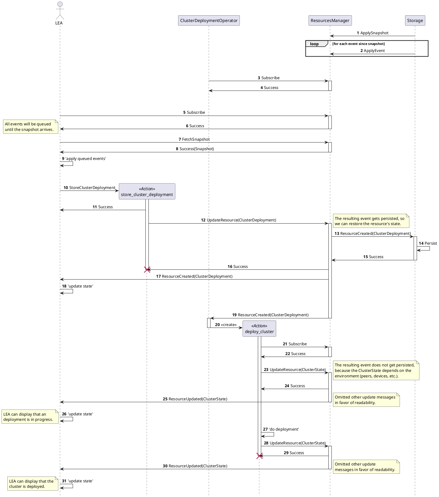

# Event Sourcing

```plantuml
@startuml

hide footbox
autonumber
skinparam sequenceMessageAlign center

actor "LEA" as lea
participant store_cluster_deployment as store_cluster_deployment <<Action>>
participant ClusterDeploymentOperator as cluster_deployment_operator
participant deploy_cluster as deploy_cluster_action <<Action>>
participant ResourcesManager as resources_manager
participant Storage as storage

storage -> resources_manager: ApplySnapshot
loop for each event since snapshot
  storage -> resources_manager: ApplyEvent
end

||50||

cluster_deployment_operator -> resources_manager ++: Subscribe
resources_manager -> cluster_deployment_operator --: Success

||50||

lea -> resources_manager ++: Subscribe
resources_manager -> lea --: Success
note left
  All events will be queued
  until the snapshot arrives.
end note
lea -> resources_manager ++: FetchSnapshot
resources_manager -> lea --: Success(Snapshot)
lea -> lea: 'apply queued events'

||50||

create store_cluster_deployment
lea -> store_cluster_deployment ++: StoreClusterDeployment
store_cluster_deployment -> lea: Success

store_cluster_deployment -> resources_manager ++: UpdateResource(ClusterDeployment)

note right
  The resulting event gets persisted, so
  we can restore the resource's state.
end note

resources_manager -> storage ++: ResourceCreated(ClusterDeployment)
storage -> storage: Persist
storage -> resources_manager --: Success

resources_manager -> store_cluster_deployment: Success
destroy store_cluster_deployment
resources_manager -> lea: ResourceCreated(ClusterDeployment)
lea -> lea: 'update state'

||50||

resources_manager -> cluster_deployment_operator --: ResourceCreated(ClusterDeployment)
activate cluster_deployment_operator

create deploy_cluster_action
cluster_deployment_operator -> deploy_cluster_action ++: <<create>>

deactivate cluster_deployment_operator

deploy_cluster_action -> resources_manager ++: Subscribe
resources_manager -> deploy_cluster_action --: Success

deploy_cluster_action -> resources_manager ++: UpdateResource(ClusterState)
note right
  The resulting event does not get persisted,
  because the ClusterState depends on the
  environment (peers, devices, etc.).
end note
resources_manager -> deploy_cluster_action: Success
resources_manager -> lea--: ResourceUpdated(ClusterState)
note right
  Omitted other update messages
  in favor of readability.
end note
lea -> lea: 'update state'
note left
  LEA can display that an
  deployment is in progress. 
end note

deploy_cluster_action -> deploy_cluster_action: 'do deployment'
deploy_cluster_action -> resources_manager ++: UpdateResource(ClusterState)

resources_manager -> deploy_cluster_action: Success
destroy deploy_cluster_action

resources_manager -> lea --: ResourceUpdated(ClusterState)
note right
  Omitted other update
  messages in favor of readability.
end note

lea -> lea: 'update state'
note left
  LEA can display that the
  cluster is deployed. 
end note

@enduml
```
