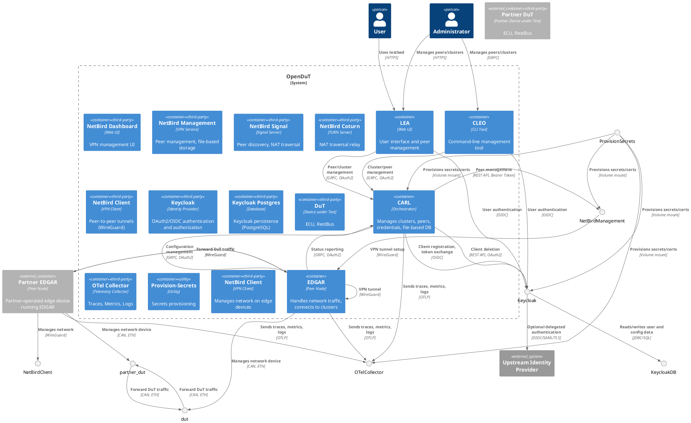

## Container View

```plantuml
@startuml
!include <C4/C4_Container>

' System boundary
System_Boundary(opendut, "OpenDuT") {
  Container(lea, "LEA", "Web UI", "User interface and peer management")
  Container(carl, "CARL", "Orchestrator", "Manages clusters, peers, credentials, file-based DB")
  Container(cleo, "CLEO", "CLI Tool", "Command-line management tool")
  Container(edgar, "EDGAR", "Peer Node", "Handles network traffic, connects to clusters")
  Container(NetBirdDashboard, "NetBird Dashboard", "Web UI", "VPN management UI") <<third-party>>
  Container(NetBirdManagement, "NetBird Management", "VPN Service", "Peer management, file-based storage") <<third-party>>
  Container(NetBirdSignal, "NetBird Signal", "Signal Server", "Peer discovery, NAT traversal") <<third-party>>
  Container(NetBirdCoturn, "NetBird Coturn", "TURN Server", "NAT traversal relay") <<third-party>>
  Container(NetBird, "NetBird Client", "VPN Client", "Peer-to-peer tunnels (WireGuard)") <<third-party>>
  Container(Keycloak, "Keycloak", "Identity Provider", "OAuth2/OIDC authentication and authorization") <<third-party>>
  Container(KeycloakDB, "Keycloak Postgres", "Database", "Keycloak persistence (PostgreSQL)") <<third-party>>
  Container(dut, "DuT", "Device under Test", "ECU, RestBus") <<third-party>>
  Container(OTelCollector, "OTel Collector", "Telemetry Collector", "Traces, Metrics, Logs") <<third-party>>
  Container(ProvisionSecrets, "Provision-Secrets", "Utility", "Secrets provisioning") <<utility>>
  Container(NetBirdClient, "NetBird Client", "VPN Client", "Manages network on edge devices") <<third-party>>
}

' External actors
Person(admin, "Administrator")
Person(user, "User")
System_Ext(idp, "Upstream Identity Provider")
Container_Ext(partner_dut, "Partner DuT", "Partner Device under Test", "ECU, RestBus") <<third-party>>
Container_Ext(partner_edgar, "Partner EDGAR", "Peer Node", "Partner-operated edge device running EDGAR")

' Relationships
Rel(admin, lea, "Manages peers/clusters", "HTTPS")
Rel(admin, cleo, "Manages peers/clusters", "GRPC")
Rel(user, lea, "Uses testbed", "HTTPS")
Rel(lea, carl, "Peer/cluster management", "GRPC, OAuth2")
Rel(lea, Keycloak, "User authentication", "OIDC")
Rel(cleo, Keycloak, "User authentication", "OIDC")
Rel(carl, Keycloak, "Client registration, token exchange", "OIDC")
Rel(carl, Keycloak, "Client deletion", "REST API, OAuth2")
Rel(carl, NetBirdManagement, "Peer management", "REST API, Bearer Token")
Rel(cleo, carl, "Cluster/peer management", "GRPC, OAuth2")
Rel(edgar, carl, "Status reporting", "GRPC, OAuth2")
Rel(edgar, dut, "Manages network device", "CAN, ETH")
Rel(carl, edgar, "Configuration management", "GRPC, OAuth2")
Rel(NetBirdManagement, edgar, "VPN tunnel setup", "WireGuard")
Rel(edgar, edgar, "VPN tunnel", "WireGuard")
Rel(Keycloak, idp, "Optional delegated authentication", "OIDC/SAML/TLS")
Rel(partner_edgar, partner_dut, "Manages network device", "CAN, ETH")
Rel_D(dut, partner_dut, "Forward DuT traffic", "CAN, ETH")
Rel_D(partner_dut, dut, "Forward DuT traffic", "CAN, ETH")
Rel_D(edgar, partner_edgar, "Forward DuT traffic", "WireGuard")
Rel_D(partner_edgar, edgar, "Forward DuT traffic", "WireGuard")
Rel(carl, OTelCollector, "Sends traces, metrics, logs", "OTLP")
Rel(edgar, OTelCollector, "Sends traces, metrics, logs", "OTLP")
Rel(partner_edgar, OTelCollector, "Sends traces, metrics, logs", "OTLP")
Rel(ProvisionSecrets, carl, "Provisions secrets/certs", "Volume mount")
Rel(ProvisionSecrets, Keycloak, "Provisions secrets/certs", "Volume mount")
Rel(ProvisionSecrets, NetBirdManagement, "Provisions secrets/certs", "Volume mount")
Rel(ProvisionSecrets, OTelCollector, "Provisions secrets/certs", "Volume mount")
Rel(Keycloak, KeycloakDB, "Reads/writes user and config data", "JDBC/SQL")
Rel(partner_edgar, NetBirdClient, "Manages network", "WireGuard")
@enduml
```
