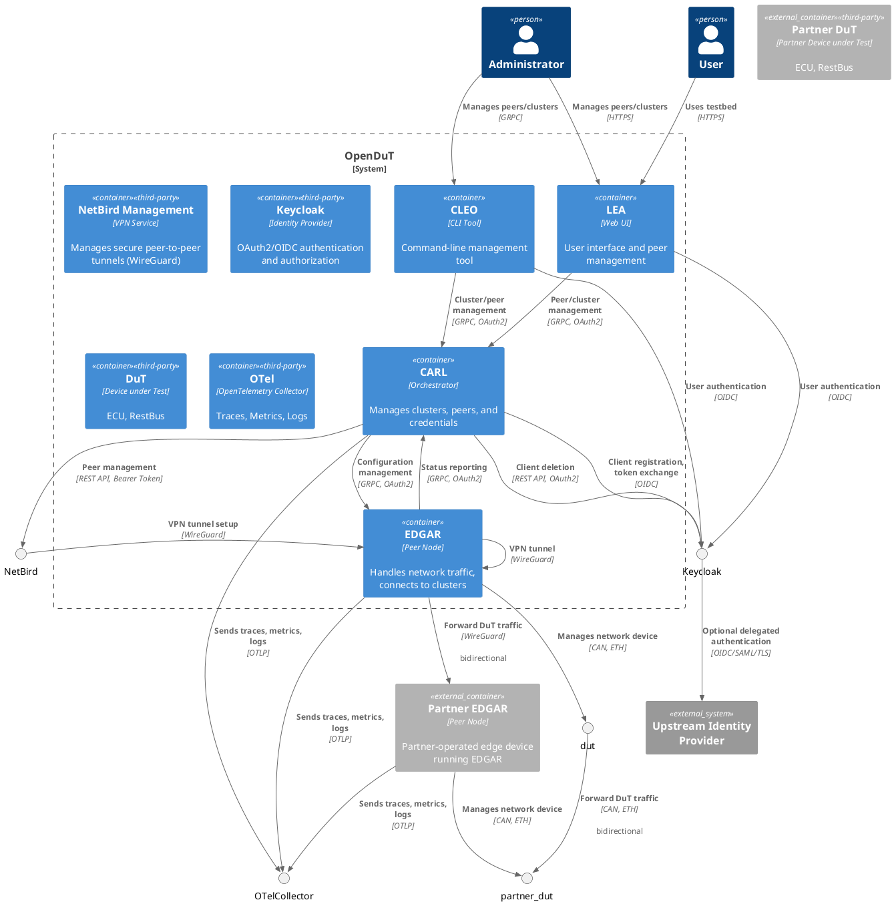

# Container View

```plantuml
@startuml
!include <C4/C4_Container>

' System boundary
System_Boundary(opendut, "OpenDuT") {
  Container(lea, "LEA", "Web UI", "User interface and peer management")
  Container(carl, "CARL", "Orchestrator", "Manages clusters, peers, and credentials")
  Container(cleo, "CLEO", "CLI Tool", "Command-line management tool")
  Container(edgar, "EDGAR", "Peer Node", "Handles network traffic, connects to clusters")
  Container(NetBird, "NetBird Management", "VPN Service", "Manages secure peer-to-peer tunnels (WireGuard)") <<third-party>>
  Container(Keycloak, "Keycloak", "Identity Provider", "OAuth2/OIDC authentication and authorization") <<third-party>>
  Container(dut, "DuT", "Device under Test", "ECU, RestBus") <<third-party>>
  Container(OTelCollector, "OTel", "OpenTelemetry Collector", "Traces, Metrics, Logs") <<third-party>>
}

' External actors
Person(admin, "Administrator")
Person(user, "User")
System_Ext(idp, "Upstream Identity Provider")
Container_Ext(partner_edgar, "Partner EDGAR", "Peer Node", "Partner-operated edge device running EDGAR")
Container_Ext(partner_dut, "Partner DuT", "Partner Device under Test", "ECU, RestBus") <<third-party>>


' Relationships
Rel(admin, lea, "Manages peers/clusters", "HTTPS")
Rel(admin, cleo, "Manages peers/clusters", "GRPC")
Rel(user, lea, "Uses testbed", "HTTPS")
Rel(lea, carl, "Peer/cluster management", "GRPC, OAuth2")
Rel(lea, Keycloak, "User authentication", "OIDC")
Rel(cleo, Keycloak, "User authentication", "OIDC")
Rel(carl, Keycloak, "Client registration, token exchange", "OIDC")
Rel(carl, Keycloak, "Client deletion", "REST API, OAuth2")
Rel(carl, NetBird, "Peer management", "REST API, Bearer Token")
Rel(cleo, carl, "Cluster/peer management", "GRPC, OAuth2")
Rel(edgar, carl, "Status reporting", "GRPC, OAuth2")
Rel(edgar, dut, "Manages network device", "CAN, ETH")
Rel(carl, edgar, "Configuration management", "GRPC, OAuth2")
Rel(NetBird, edgar, "VPN tunnel setup", "WireGuard")
Rel(edgar, edgar, "VPN tunnel", "WireGuard")
Rel(Keycloak, idp, "Optional delegated authentication", "OIDC/SAML/TLS")

' Telemetry
Rel(carl, OTelCollector, "Sends traces, metrics, logs", "OTLP")
Rel(edgar, OTelCollector, "Sends traces, metrics, logs", "OTLP")
Rel(partner_edgar, OTelCollector, "Sends traces, metrics, logs", "OTLP")

' Network traffic between DuT and Partner DuT via EDGAR and Partner EDGAR
Rel_D(dut, partner_dut, "Forward DuT traffic", "CAN, ETH", "bidirectional")
Rel_D(edgar, partner_edgar, "Forward DuT traffic", "WireGuard", "bidirectional")
Rel(partner_edgar, partner_dut, "Manages network device", "CAN, ETH")


@enduml
```