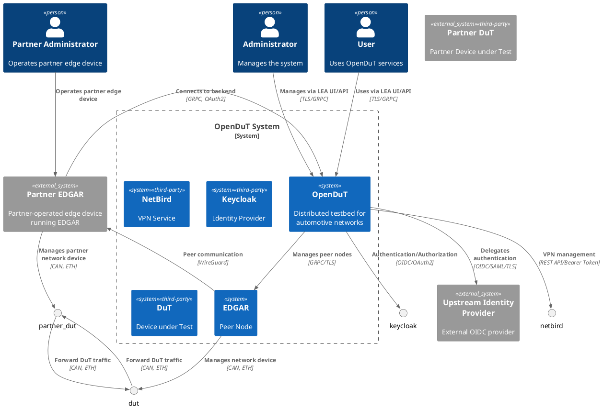

## System Context View

> **Note:** At the moment, the authorization concept is a draft because users and administrators cannot be distinguished, yet. The diagrams below illustrate the intended architecture.

