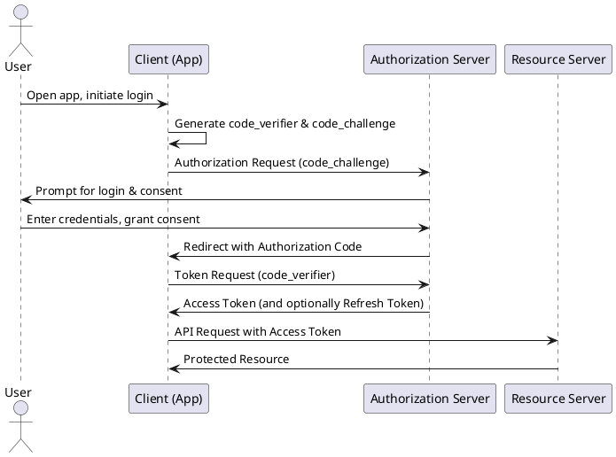
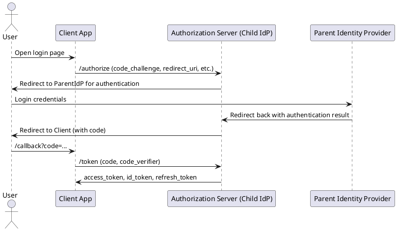

## OAuth 2.0 Authorization Code Flow with PKCE
Here is a PlantUML sequence diagram illustrating an OAuth 2.0 Authorization Code flow with PKCE:



## OAuth 2.0 Authorization Code Flow with PKCE and Parent IdP Redirection

Here is a PlantUML sequence diagram illustrating an OAuth 2.0 Authorization Code flow with PKCE, including a redirection to a parent identity provider (IdP):



**Explanation:**
- The user initiates login in the client app.
- The client app starts the PKCE flow by sending the `code_challenge` to the child IdP.
- The child IdP redirects the user to the parent IdP for authentication.
- After successful authentication, the parent IdP redirects back to the child IdP.
- The child IdP issues an authorization code and redirects the user back to the client.
- The client exchanges the code and `code_verifier` for tokens.

This covers PKCE and federated login via a parent IdP.


## System context view

```plantuml
@startuml
!includeurl https://raw.githubusercontent.com/plantuml-stdlib/C4-PlantUML/master/C4_Context.puml

Person(user, "User")
System(lea, "LEA (Web UI)")
System(cleo, "CLEO (CLI)")
System(thirdParty, "3rd Party Tool")
System(carl, "CARL Backend")
System(edgar_leader, "EDGAR Leader")
System(edgar_follower, "EDGAR Follower")

Boundary(edge_cluster, "EDGAR Device Cluster") {
    System(edgar_leader, "EDGAR Leader")
    System(edgar_follower, "EDGAR Follower")
}

System_Ext(dut1, "Device under Test 1")
System_Ext(dut2, "Device under Test 2")
System_Ext(dut3, "Device under Test 3")

Rel(user, lea, "Uses via browser")
Rel(user, cleo, "Uses via CLI")
Rel(lea, carl, "API calls (gRPC)")
Rel(cleo, carl, "API calls (gRPC)")
Rel(thirdParty, carl, "gRPC API")
Rel(carl, edgar_leader, "Controls and manages")
Rel(carl, edgar_follower, "Controls and manages")
Rel(edgar_leader, edgar_follower, "Cluster communication (CAN/GRE tunnels)")
Rel(dut1, edgar_leader, "Attached via Ethernet/CAN")
Rel(dut2, edgar_leader, "Attached via Ethernet/CAN")
Rel(dut3, edgar_follower, "Attached via Ethernet/CAN")

@enduml
```