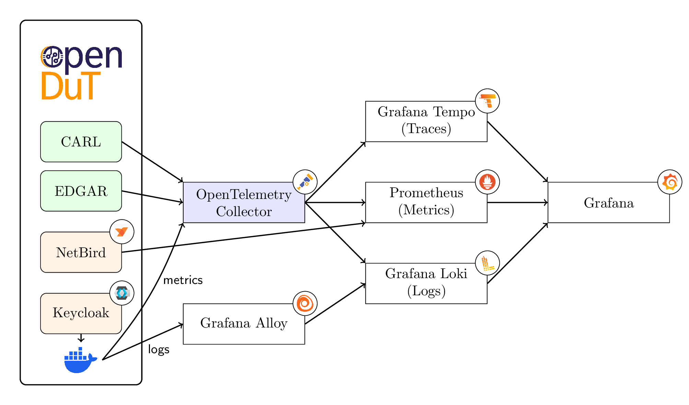

# Telemetry

OpenDuT components support sending telemetry information — including logs, traces, and metrics — to the OpenTelemetry Collector.
This flexible architecture makes it easy to attach your observability stack of choice. 
The following image shows an example setup using the [Grafana Stack](https://grafana.com).

Components in this setup:

* [OpenTelemetry Collector (OTEL Collector)](https://opentelemetry.io/docs/collector/configuration/): Collects logs, metrics, and traces from OpenDuT components and the Docker daemon.
* [Grafana Alloy](https://grafana.com/docs/alloy/latest/): Collects logs from the Docker daemon (e.g. NetBird, Keycloak and other components not depicted above).

Databases used:

* [Prometheus](https://prometheus.io/docs/introduction/overview/): Collects metrics from the Netbird management service and consumes all metrics from the OTEL Collector.
* [Grafana Loki](https://grafana.com/docs/loki/latest/): Stores logs collected by the OTEL Collector and by Grafana Alloy.
* [Grafana Tempo](https://grafana.com/docs/tempo/latest/): Stores traces.

Visualization: [Grafana](https://grafana.com/docs/grafana/latest/) uses these databases to present dashboards to the user.

Note: The use of third-party logos in architecture diagrams is solely for informational and attribution purposes. Their inclusion does not imply endorsement or partnership with any of the respective organizations. 
All trademarks and logos remain the property of their respective owners.
