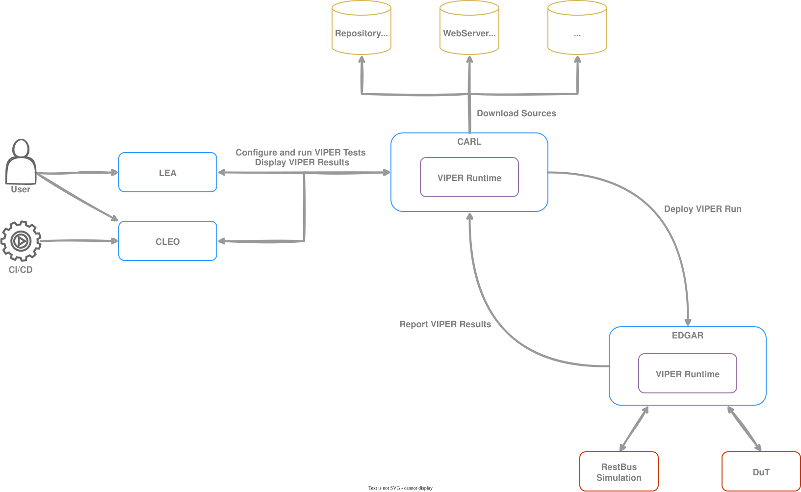
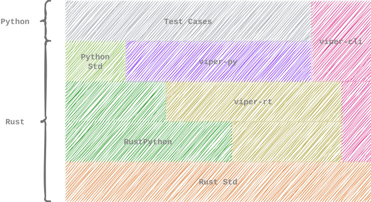

# VIPER

VIPER provides a test execution platform.

## Overview



- Source code is stored outside of openDuT.
- CARL uses the VIPER-Runtime to download, analyze and provide insights of VIPER test suites.
- EDGAR uses the VIPER-Runtime to compile and run test suites.

### Examples

#### Common Structure

```python
# VIPER_VERSION = 1.0
from viper import unittest

class MyTestCases(unittest.TestCase):

    def setUp(self):
        pass

    def test_my_awesome_shit(self):
        pass

    def tearDown(self):
        pass
```

#### Assertion Functions

```python
# VIPER_VERSION = 1.0
from viper import unittest

class MyTestCase(unittest.TestCase):

    def test_addition(self):
        self.assertEquals(5 + 7, 12)
```


#### Parameters

```python
# VIPER_VERSION = 1.0
from viper import *

MESSAGE = parameters.TextParameter("message")

class TestCases:

    def test_my_parameter():
        message = self.parameters.get(MESSAGE)
        self.assertEquals(message, "Hello World")
```


#### Container API

```python
# VIPER_VERSION = 1.0
from viper import unittest

class MyTestCases(unittest.TestCase):

    def test_with_container(self):

        my_container = self.container.create(
            "docker.io/library/alpine:latest",
            ["Hello World"],
            entrypoint=["echo"],
            env = ["DEBUG=true"],
            user="1000",
            name="MyContainer"
        )

        self.container.start(my_container)

        self.container.stop(my_container)

        self.container.remove(my_container)
```

## Architecture of VIPER



### viper-rt

The VIPER-Runtime is the heart of VIPER implemented as library to be included in openDuT. It provides:
- The main API for openDuT.
- Functions to download, compile and run tests written in Python.
- Is entirely written in Rust so it can be integrated into openDuT easily.
- Provides an abstraction over RustPython.

### viper-py
Main API a test author works against. It provides data structures and functions to:
- Exchange information with openDuT.
- Interact with the environment.
- Provides capabilities to define test- and assert logic.
- Written in Rust and a little bit in Python.

### viper-cli

The viper-cli is a command line interface (CLI) to:
- Setup and maintain test suites.
- Compile and check test locally before deployment.
- Mock "real" interfaces (can, files, etc.) to enable a 'dry-run' of a test suite.

## Integration

This is how we plan to integrate VIPER into the openDuT communication:

```plantuml
participant "LEA/CLEO" as UI
participant CARL
participant EDGAR
participant "VIPER-Runtime" as VIPER
participant Source


== Defining a test suite source ==

UI --> CARL: Store source definition\n(SourceDescriptor)
UI <-- CARL: Success


== Parametrizing a test suite run ==

UI --> CARL: GetViperTestSuiteParameters(source_id)
CARL -> VIPER: SourceDescriptor

activate VIPER
VIPER --> Source: Fetch
VIPER <-- Source: Source code
VIPER -> VIPER: Compile
CARL <- VIPER: ParameterDescriptors
deactivate VIPER

UI <-- CARL: ViperTestSuiteParameters

note over UI: User enters parameter values

UI --> CARL: StoreViperTestRunDescriptor
UI <-- CARL: Success


== Running a test suite ==

UI --> CARL: StoreViperTestRunDeployment (triggers test run)
CARL --> UI: Success


group Pre-fetch source code

note over CARL, VIPER: CARL fetches source code (using VIPER as library), so \nthat EDGAR does not need network access to the Source.
CARL -> VIPER: SourceDescriptor
activate VIPER
VIPER --> Source: Fetch
VIPER <-- Source: Source code
CARL <- VIPER: Source code
deactivate VIPER

end


CARL --> EDGAR: Selected suite name & \n source code & parameter values

EDGAR -> VIPER: Selected suite name & \n source code & parameter values

activate VIPER
VIPER -> VIPER: Compile & Run \n(EmbeddedSource)
EDGAR <- VIPER: Test results
deactivate VIPER

CARL <-- EDGAR: Test results

UI --> CARL: Request test completion state
UI <-- CARL: Test completion state
```

Network calls are indicated by dotted arrows.  
Function calls are indicated by solid arrows. (VIPER-Runtime is a library, included by both CARL and EDGAR.)
