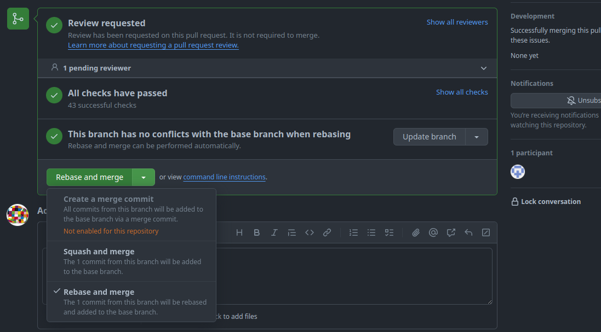

# Git Workflow

## Pull requests

### Rebase and Merge

Our goal is to maintain a linear Git history. Therefor we prefer `git rebase` over `git merge`[^ff-only]. A problem arises when working with [pull requests (PR)](https://docs.github.com/en/pull-requests/collaborating-with-pull-requests/proposing-changes-to-your-work-with-pull-requests/about-pull-requests), because the GitHub WebUI offers ineligible options to merge a feature-branch:



1. __Create a merge commit__:

    The first option creates a merge commit to pull in the changes from the PR's target branch and this is against our goal of a linear history, so we disabled this option.

2. __Squash and merge__:

    The second option squashes all commits of made to the PR into a single commit and add it to the PR's target branch. With this option it is not possible to keep all commits of the PR separately.

3. __Rebase and merge__: 

    The third option rebases the changes of the feature branch on top of the PR's target branch. This would be our preferred option, __but__ "The rebase and merge behavior on GitHub deviates slightly from `git rebase`. Rebase and merge on GitHub will always update the committer information and create new commit SHAs"[^gh-rebase-and-merge]. This doubles the number of commits and spams the history unnecessarily. Therefor we do __not__ use this option too.

The only viable option for us is to rebase and merge the changes via the command line. The procedures slightly differ according to the location of the feature branch.

#### Feature branch within the same repository

This example illustrates the procedure to merge a feature branch `fubar` into a target branch `development`.

1. Update the target branch with the latest changes.
   ```shell
   git pull --rebase origin development
   ```

2. Switch to the feature branch.
   ```shell
   git checkout fubar
   ```

3. Rebase the changes of the feature branch on top of the target branch.
   ```shell
   git rebase development
   ```
   At this point it can happen that you have to resolve merge conflicts. It is also a good moment to run test and validation tasks to verify the changes.

4. Switch to the target branch.
   ```shell
   git checkout development
   ```

5. Merge the changes of the feature branch into the target branch.
   ```shell
   git merge --ff-only fubar
   ```
   The `--ff-only` argument at this point is optional, because we rebased the feature branch and git automatically detects, that a fast-forward is possible. But this flag prevents a merge-commit if we messed-up one of the previous steps.

6. Push the changes.
   ```shell
   git push origin development
   ```

#### Feature branch of a fork repository

This example illustrates the procedure to merge a feature branch `foo` from a fork `bar` of the user `doe` into a target branch `development`.

1. From the project repository, check out a new branch.
   ```shell
   git checkout -b doe-foo development
   ```

2. Pull in the changes from the fork.
   ```shell
   git pull git@github.com:doe/bar.git foo
   ```

3. Rebase the changes of the feature branch on top of the target branch.
   ```shell
   git rebase development
   ```
   At this point it can happen that you have to resolve merge conflicts. It is also a good moment to run test and validation tasks to verify the changes.

4. Switch to the target branch.
   ```shell
   git checkout development
   ```

5. Merge the changes of the feature branch into the target branch.
   ```shell
   git merge --ff-only fubar
   ```
   The `--ff-only` argument at this point is optional, because we rebased the feature branch and git automatically detects, that a fast-forward is possible. But this flag prevents a merge-commit if we messed-up one of the previous steps.

6. Push the changes.
   ```shell
   git push origin development
   ```

[^ff-only]: Except `git merge --ff-only`.

[^gh-rebase-and-merge]: [Github; About pull requests; Rebasing and merging your commits](https://docs.github.com/en/repositories/configuring-branches-and-merges-in-your-repository/configuring-pull-request-merges/about-merge-methods-on-github#rebasing-and-merging-your-commits)
