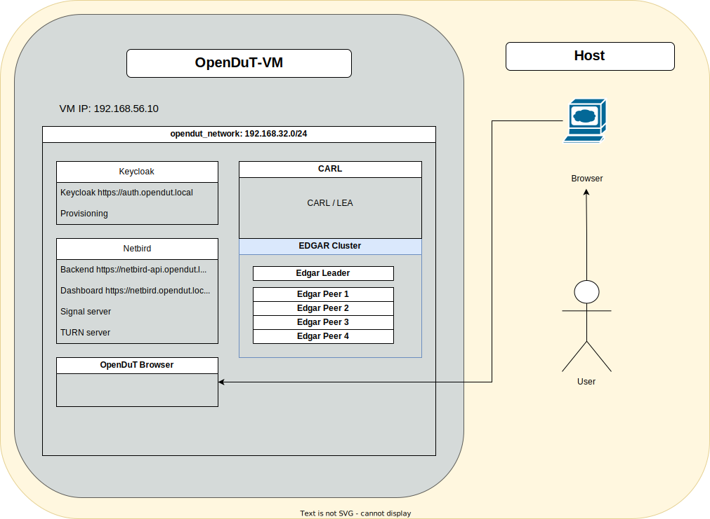
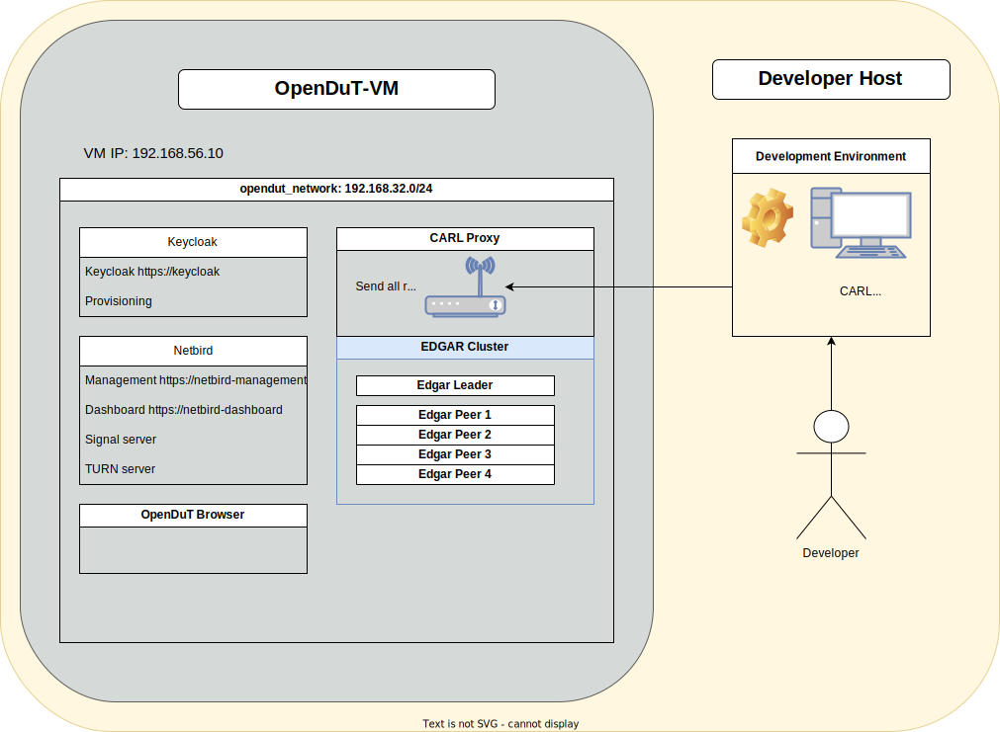

# Test Environment

openDuT can be tricky to test, as it needs to modify the operating system to function and supports networking in a distributed setup.  
To aid in this, we offer a virtualized test environment for development.  
This test environment is set up with the help of a command line tool called `theo`.
THEO stands for **Test Harness Environment Operator**.

It is recommended to start everything in a virtual machine, but you may also start the service on the host with `docker compose` if applicable.
Setup of the virtual machine is done with Vagrant, Virtualbox and Ansible.
The following services are included in docker:
- carl
- edgar
- firefox container for UI testing (accessible via http://localhost:3000) 
  - includes certificate authorities and is running in headless mode
  - is running in same network as carl and edgar (working DNS resolution!)
- netbird
- keycloak

## Operational modes

There are two ways of operation for the test environment:

### Test mode

Run everything in Docker (Either on your host or preferable in a virtual machine).
You may use the **OpenDuT Browser** to access the services.
The OpenDuT Browser is a web browser running in a docker container in the same network as the other services.
All certificates are pre-installed and the browser is running in headless mode.
It is accessible from your host via http://localhost:3000.

### Development mode

Run CARL on the host in your development environment of choice and the rest in Docker.
In this case there is a proxy running in the docker environment. 
It works as a drop-in replacement for CARL in the docker environment, which is forwarding the traffic to CARL running in an integrated development environment on the host.

## Getting started

Set up the virtual machine
* on [Windows](theo-setup-vm-windows.md)
* on [Linux](theo-setup-vm-linux.md)

Then you may start the test environment in the virtual machine.
* And use it in [test mode](theo-use-test-mode.md)
* Or use it in [development mode](theo-use-development-mode.md).

There are some known issues with the test environment (most of them on Windows): 
* [known issues section](known-issues.md)

## Start testing

Once you have set up and started the test environment, you may start testing the services.

### User interface

The **OpenDuT Browser** is a web browser running in a docker container.
It is based on KasmVNC base image which allows containerized desktop applications from a web browser.
A port forwarding is in place to access the browser from your host.
It has all the necessary certificates pre-installed and is running in headless mode.
You may use this **OpenDuT Browser** to access the services.

* Open following address in your browser: http://localhost:3000
* Usernames for test environment:
  * LEA: opendut:opendut
  * Keycloak: admin:admin123456
  * Netbird: netbird:netbird
* Services with user interface:
  * https://carl
  * https://netbird-dashboard
  * https://keycloak

