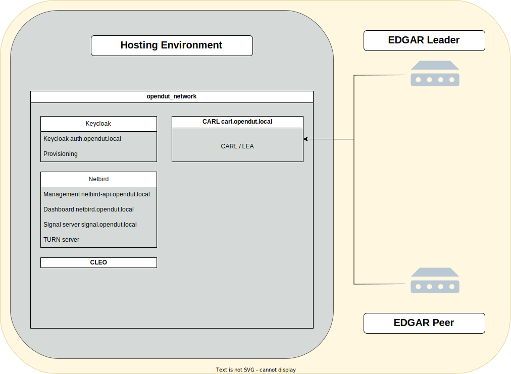

# Setup of CARL

Currently, our setup is automated via Docker Compose.  

If you want to use CARL and its components on a separate machine, i.e. a Raspberry PI 
or any other machine, this guide will show all necessary steps, to get CARL up and running.



1. Install Git, if not already installed and checkout OpenDuT repository
    ```shell
    git clone https://github.com/eclipse-opendut/opendut.git
    ```
2. Install `docker.io` and `docker-compose-v2`
3. Optional: Change the docker image location CARL should be pulled from in `.ci/deploy/localenv/docker-compose.yml`. By default,
CARL is pulled from `ghcr.io`.
4. Set `/etc/hosts` file:
Add the following lines to the `/etc/hosts` file on the host system to access the services from the local network.
    ```shell
    192.168.56.9 opendut.local
    192.168.56.9 auth.opendut.local
    192.168.56.9 netbird.opendut.local
    192.168.56.9 netbird-api.opendut.local
    192.168.56.9 signal.opendut.local
    192.168.56.9 carl.opendut.local
    192.168.56.9 nginx-webdav.opendut.local
    192.168.56.9 opentelemetry.opendut.local
    192.168.56.9 monitoring.opendut.local
    ```
5. Start the local test environment using docker compose.
    ```shell
    # configure project path
    export OPENDUT_REPO_ROOT=$(git rev-parse --show-toplevel)
    # start provisioning and create .env file
    docker compose --file ${OPENDUT_REPO_ROOT:-.}/.ci/deploy/localenv/docker-compose.yml up --build provision-secrets
    # start the environment
    docker compose --file ${OPENDUT_REPO_ROOT:-.}/.ci/deploy/localenv/docker-compose.yml --env-file ${OPENDUT_REPO_ROOT:-.}/.ci/deploy/localenv/data/secrets/.env up --detach --build
    ```
    In this step secrets are going to be created and all containers are getting started. \
    The secrets which were created during the first `docker compose` command can be found in `.ci/deploy/localenv/data/secrets/.env`.

If everything worked and is up and running, you can follow the [EDGAR Setup Guide](../edgar/setup.md).

## Shutdown the environment

* Stop the local test environment using docker compose.
```shell
docker compose --file ${OPENDUT_REPO_ROOT:-.}/.ci/deploy/localenv/docker-compose.yml down
```

* Destroy the local test environment using docker compose.
```shell
docker compose --file ${OPENDUT_REPO_ROOT:-.}/.ci/deploy/localenv/docker-compose.yml down --volumes
```

## Configuration
- If you followed the setup guide for CARL, there is no need to manually create this `carl.toml` file.
- To configure CARL, you can create a configuration file under `/etc/opendut/carl.toml`.  
The possible configuration values and their defaults can be seen here:  
```toml
{{#include ../../../../opendut-carl/carl.toml}}
```
